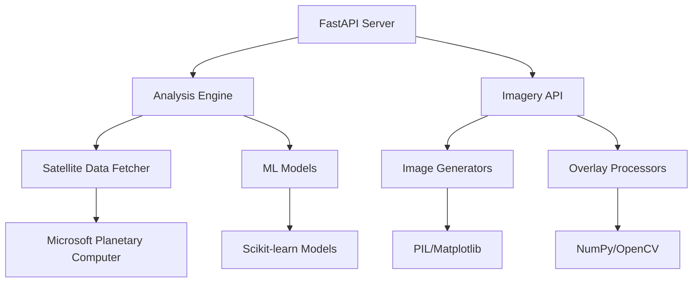
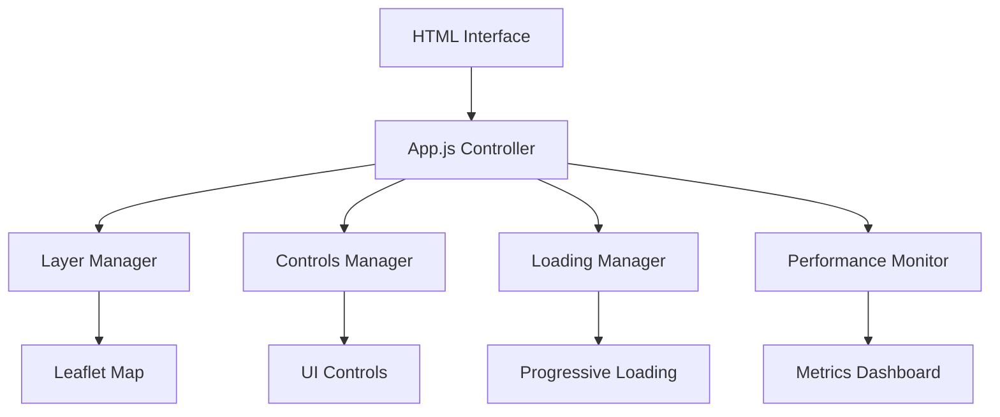

# 🌊 Kelpie Carbon v1: Kelp Forest Carbon Sequestration Assessment

[](https://www.python.org/downloads/)
[](https://fastapi.tiangolo.com/)
[](https://leafletjs.com/)
[](https://opensource.org/licenses/MIT)

A sophisticated satellite imagery analysis application for assessing kelp forest carbon sequestration using Sentinel-2 data. Built with FastAPI, Leaflet, and advanced computer vision techniques.

## 🌟 **Features**

### **🛰️ Satellite Imagery Analysis**
- **Real-time Sentinel-2 Data**: Automatic fetching from Microsoft Planetary Computer
- **Spectral Index Calculation**: NDVI, FAI, NDRE for vegetation analysis
- **Kelp Detection**: Advanced machine learning-based kelp forest identification
- **Cloud/Water Masking**: Automated quality filtering and water body detection

### **🗺️ Interactive Visualization**
- **Dynamic Layer Management**: Toggle RGB, spectral indices, and analysis overlays
- **Fixed Layer Switching**: All layers now display correctly with improved async loading
- **Opacity Controls**: Fine-tune layer transparency for optimal visualization
- **Real-time Legend**: Dynamic legend updates based on active layers
- **Metadata Panel**: Detailed information about imagery acquisition and processing

### **⚡ Performance & Reliability**
- **Progressive Loading**: Priority-based layer loading for optimal user experience
- **Image Caching**: Browser-side caching with automatic cleanup
- **Error Recovery**: Exponential backoff retry mechanisms
- **Performance Monitoring**: Real-time performance dashboard and metrics

### **🔬 Scientific Analysis**
- **Carbon Sequestration Estimates**: Biomass-based carbon storage calculations
- **Temporal Analysis**: Multi-date comparison capabilities
- **Quality Metrics**: Cloud coverage and data quality assessment
- **Export Capabilities**: Data export for further scientific analysis

### **🌿 Validation Framework (SKEMA Integration)**
- **BC Kelp Forest Validation**: Specialized validation protocols for British Columbia kelp forests
- **Field Campaign Management**: Complete workflow for ground truth data collection
- **NDRE vs NDVI Comparison**: Research-validated spectral index performance assessment
- **Mock Data Generation**: Realistic BC kelp forest data for testing and development
- **Performance Metrics**: SKEMA research-aligned validation scoring (accuracy, area improvement, submerged detection)

## 🚀 **Quick Start**

### **Prerequisites**
- Python 3.12+
- Poetry (for dependency management)
- Modern web browser (Chrome, Firefox, Safari, Edge)

### **Installation**

```bash
# Clone the repository
git clone https://github.com/your-org/kelpie-carbon-v1.git
cd kelpie-carbon-v1

# Quick setup for developers
make setup

# Or manual installation
poetry install
poetry shell
```

> 📚 **New Developer?** Check out our [Developer Onboarding Guide](docs/DEVELOPER_ONBOARDING.md) for a complete setup walkthrough!

### **Running the Application**

#### **Using the CLI (Recommended)**
```bash
# Start the web server with automatic port detection
poetry run kelpie-carbon-v1 serve --auto-port --reload

# Or use the convenient Makefile
make serve-auto

# Start with custom settings
poetry run kelpie-carbon-v1 serve --host 0.0.0.0 --port 8080 --reload

# Run analysis from command line
poetry run kelpie-carbon-v1 analyze 36.8 -121.9 2023-08-01 2023-08-31 --output results.json

# Generate BC validation dataset (SKEMA Integration)
python -c "
from kelpie_carbon_v1.validation import ValidationDataManager, MockValidationGenerator
manager = ValidationDataManager('validation_data')
generator = MockValidationGenerator(manager)
campaign_id = generator.create_bc_validation_dataset('saanich_inlet')
print(f'Created BC validation campaign: {campaign_id}')
"

# Show configuration
poetry run kelpie-carbon-v1 config

# Run tests
make test
```

#### **Using Uvicorn Directly**
```bash
# Start the FastAPI server
poetry run uvicorn src.kelpie_carbon_v1.api.main:app --host 0.0.0.0 --port 8000

# Open your browser to http://localhost:8000
```

### **Environment Configuration**

The application supports environment-based configuration:

```bash
# Set environment (development is default)
export KELPIE_ENV=development  # or production

# Start server with environment-specific settings
poetry run kelpie-carbon-v1 serve
```

### **Basic Usage**

1. **Select Area of Interest (AOI)**: Click on the map to choose your study area
2. **Set Date Range**: Choose start and end dates for satellite imagery
3. **Run Analysis**: Click "Run Analysis" to process satellite data
4. **Explore Results**: Use interactive controls to visualize different layers
5. **Monitor Performance**: Press `Ctrl+Shift+P` for performance dashboard

## 📖 **Documentation**

### **Project Structure**
```
kelpie-carbon-v1/
├── src/kelpie_carbon_v1/          # Main application code
│   ├── api/                       # FastAPI backend
│   │   ├── main.py               # API entry point with config & logging
│   │   └── imagery.py            # Satellite imagery endpoints
│   ├── core/                      # Core analysis modules
│   │   ├── fetch.py              # Satellite data fetching
│   │   ├── model.py              # Machine learning models
│   │   ├── mask.py               # Masking operations
│   │   └── indices.py            # Spectral index calculations
│   ├── imagery/                   # Image processing utilities
│   │   ├── generators.py         # Image generation
│   │   ├── overlays.py           # Analysis overlays
│   │   └── utils.py              # Utility functions
│   ├── validation/                # SKEMA validation framework
│   │   ├── data_manager.py       # Campaign and ground truth data management
│   │   ├── mock_data.py          # BC kelp forest mock data generation
│   │   ├── metrics.py            # NDRE vs NDVI validation metrics
│   │   └── field_protocols.py    # BC field campaign protocols
│   ├── web/                       # Frontend application
│   │   └── static/               # Static web assets
│   │       ├── index.html        # Main web interface
│   │       ├── app.js            # Main application logic
│   │       ├── layers.js         # Layer management
│   │       ├── controls.js       # Interactive controls
│   │       ├── loading.js        # Progressive loading
│   │       ├── performance.js    # Performance monitoring
│   │       └── style.css         # Styling
│   ├── config.py                 # Configuration management
│   ├── logging_config.py         # Logging setup
│   └── cli.py                    # Enhanced CLI interface
├── config/                        # Configuration files
│   ├── base.yml                  # Base configuration
│   ├── development.yml           # Development settings
│   └── production.yml            # Production settings
├── tests/                         # Test suite (organized)
├── docs/                          # Documentation
│   ├── VALIDATION_DATA_FRAMEWORK.md  # BC validation framework guide
│   ├── SKEMA_INTEGRATION_TASK_LIST.md # Task tracking and progress
│   └── TASK_2_COMPLETION_SUMMARY.md  # Task 2 completion details
└── pyproject.toml                # Project configuration
```

### **API Documentation**
When the server is running, visit:
- **Interactive API Docs**: http://localhost:8000/docs
- **OpenAPI Schema**: http://localhost:8000/openapi.json

### **Phase Implementation Guide**
The project was developed in 5 phases:

1. **[Phase 1: Core Image Generation](docs/PHASE1_CORE_IMAGE_GENERATION.md)**
2. **[Phase 2: Spectral Visualizations](docs/PHASE2_SPECTRAL_VISUALIZATIONS.md)**
3. **[Phase 3: Analysis Overlays](docs/PHASE3_ANALYSIS_OVERLAYS.md)**
4. **[Phase 4: Interactive Controls](docs/PHASE4_INTERACTIVE_CONTROLS.md)**
5. **[Phase 5: Performance & Polish](docs/PHASE5_PERFORMANCE_POLISH.md)**

## 🧪 **Testing**

### **Running Tests**
```bash
# Run all tests
poetry run pytest

# Run with coverage
poetry run pytest --cov=src --cov-report=html

# Run specific test categories
poetry run pytest tests/test_api.py          # API tests
poetry run pytest tests/test_imagery.py     # Imagery processing tests
poetry run pytest tests/test_integration.py # Integration tests
```

### **Test Categories**
- **Unit Tests**: Individual component testing
- **Integration Tests**: End-to-end workflow testing
- **Performance Tests**: Load and performance validation
- **API Tests**: REST endpoint validation

## 🏗️ **Architecture**

### **Backend Architecture**


### **Frontend Architecture**


### **Data Flow**
1. **User Selection**: AOI and date range selection
2. **Data Fetching**: Sentinel-2 data retrieval from Planetary Computer
3. **Processing**: Spectral analysis, masking, and ML inference
4. **Visualization**: Dynamic layer generation and caching
5. **Interaction**: Real-time controls and performance monitoring

## 🔧 **Configuration**

### **Environment Variables**
```bash
# Optional: Custom data directories
KELPIE_DATA_DIR=/path/to/data
KELPIE_CACHE_DIR=/path/to/cache

# Optional: Performance tuning
KELPIE_MAX_WORKERS=4
KELPIE_CACHE_SIZE=1000
```

### **Performance Tuning**
- **Cache Size**: Adjust browser cache limits in `loading.js`
- **Worker Threads**: Configure parallel processing in `main.py`
- **Image Quality**: Modify compression settings in `imagery.py`

## 🤝 **Contributing**

### **Development Setup**
```bash
# Fork and clone the repository
git clone https://github.com/your-username/kelpie-carbon-v1.git
cd kelpie-carbon-v1

# Install development dependencies
poetry install --with dev

# Install pre-commit hooks
poetry run pre-commit install

# Run tests before committing
poetry run pytest
```

### **Code Style**
- **Python**: Follow PEP 8, use `black` for formatting
- **JavaScript**: Use ES6+, follow Airbnb style guide
- **Documentation**: Use Google docstring format

### **Pull Request Process**
1. Create feature branch from `main`
2. Implement changes with tests
3. Update documentation as needed
4. Ensure all tests pass
5. Submit pull request with clear description

## 📊 **Performance Metrics**

### **Typical Performance**
- **Page Load**: < 2 seconds
- **Analysis Time**: 30-60 seconds (depends on area size)
- **Layer Loading**: < 5 seconds (cached: < 1 second)
- **Memory Usage**: < 100MB browser heap

### **Monitoring**
- **Real-time Dashboard**: `Ctrl+Shift+P` in browser
- **Server Logs**: Monitor FastAPI console output
- **Performance Export**: JSON metrics available via dashboard

## 🐛 **Troubleshooting**

### **Common Issues**

#### **Server Won't Start**
```bash
# Check if port 8000 is already in use
netstat -an | grep 8000

# Use different port
poetry run uvicorn src.kelpie_carbon_v1.api.main:app --port 8001
```

#### **Satellite Data Not Loading**
- Check internet connection
- Verify Microsoft Planetary Computer API accessibility
- Review server logs for authentication issues

#### **Performance Issues**
- Clear browser cache and restart
- Check available system memory
- Use performance dashboard to identify bottlenecks

### **Error Codes**
- **422**: Invalid input data or missing parameters
- **404**: Analysis ID not found or expired
- **500**: Server processing error (check logs)

## 📚 **Scientific Background**

### **Kelp Forest Importance**
Kelp forests are among the most productive ecosystems on Earth, sequestering significant amounts of carbon dioxide. This application helps quantify their contribution to blue carbon storage.

### **Remote Sensing Approach**
- **Sentinel-2**: 10-60m resolution multispectral imagery
- **Spectral Indices**: Vegetation and algae-specific calculations
- **Machine Learning**: Automated kelp detection and classification

### **Carbon Calculations**
Biomass estimates are converted to carbon storage using established allometric relationships and carbon content factors from peer-reviewed literature.

## 📄 **License**

This project is licensed under the MIT License - see the [LICENSE](LICENSE) file for details.

## 🙏 **Acknowledgments**

- **Microsoft Planetary Computer** for Sentinel-2 data access
- **ESA Copernicus Program** for Sentinel-2 satellite imagery
- **Leaflet.js** for interactive mapping capabilities
- **FastAPI** for high-performance API framework

## 📞 **Support**

- **Issues**: [GitHub Issues](https://github.com/your-org/kelpie-carbon-v1/issues)
- **Discussions**: [GitHub Discussions](https://github.com/your-org/kelpie-carbon-v1/discussions)
- **Documentation**: [Project Wiki](https://github.com/your-org/kelpie-carbon-v1/wiki)

---

**Made with 🌊 for ocean conservation and blue carbon research**
