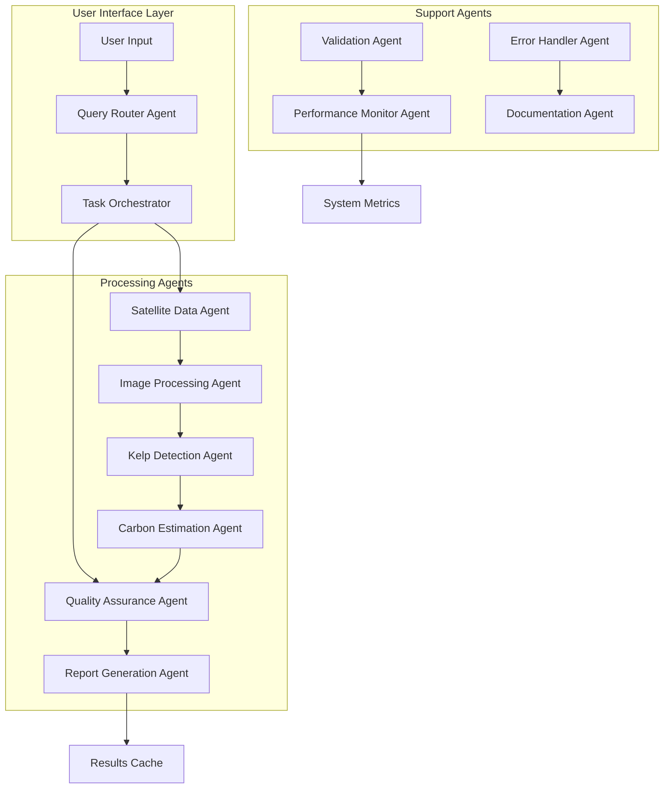

# 🤖 AI Agents in Kelpie Carbon v1

**Last Updated**: January 11, 2025  
**Version**: 1.0  
**Purpose**: Documentation of AI agents architecture, implementation, and integration within the Kelpie Carbon v1 kelp detection and carbon assessment system

---

## 📋 **Overview**

The Kelpie Carbon v1 system leverages multiple AI agents to enhance kelp forest detection, carbon sequestration assessment, and system optimization. This document provides comprehensive guidance on AI agent architecture, implementation patterns, and best practices for integrating agents into the existing system.

---

## 🏗️ **Agent Architecture**

### **Multi-Agent System Design**



### **Agent Types**

#### **1. Processing Agents**
- **Satellite Data Agent**: Retrieves and preprocesses Sentinel-2 imagery
- **Image Processing Agent**: Handles spectral analysis and band calculations
- **Kelp Detection Agent**: ML-based kelp forest identification
- **Carbon Estimation Agent**: Biomass-to-carbon conversion calculations

#### **2. Orchestration Agents**
- **Query Router Agent**: Routes user requests to appropriate processing chains
- **Task Orchestrator**: Manages agent workflow and dependencies
- **Quality Assurance Agent**: Validates results and ensures accuracy

#### **3. Support Agents**
- **Validation Agent**: Performs real-time data validation and error checking
- **Performance Monitor Agent**: Tracks system performance and optimization
- **Error Handler Agent**: Manages error recovery and fallback strategies
- **Documentation Agent**: Auto-generates reports and documentation

---

## 🔧 **Implementation Framework**

### **Agent Base Class**

```python
from abc import ABC, abstractmethod
from typing import Any, Dict, Optional
from dataclasses import dataclass
from enum import Enum

class AgentStatus(Enum):
    IDLE = "idle"
    PROCESSING = "processing"
    COMPLETED = "completed"
    ERROR = "error"

@dataclass
class AgentResult:
    status: AgentStatus
    data: Optional[Any] = None
    error: Optional[str] = None
    metadata: Optional[Dict[str, Any]] = None

class BaseAgent(ABC):
    """Base class for all Kelpie Carbon v1 agents"""
    
    def __init__(self, agent_id: str, config: Dict[str, Any]):
        self.agent_id = agent_id
        self.config = config
        self.status = AgentStatus.IDLE
        self.metrics = {}
    
    @abstractmethod
    async def process(self, input_data: Any) -> AgentResult:
        """Main processing method to be implemented by each agent"""
        pass
    
    @abstractmethod
    def validate_input(self, input_data: Any) -> bool:
        """Validate input data before processing"""
        pass
    
    def get_status(self) -> AgentStatus:
        return self.status
    
    def get_metrics(self) -> Dict[str, Any]:
        return self.metrics
```

### **Satellite Data Agent Implementation**

```python
from src.kelpie_carbon_v1.core.fetch import fetch_satellite_data
from src.kelpie_carbon_v1.utils.validation import CoordinateValidator

class SatelliteDataAgent(BaseAgent):
    """Agent responsible for satellite data retrieval and preprocessing"""
    
    async def process(self, input_data: Dict[str, Any]) -> AgentResult:
        try:
            self.status = AgentStatus.PROCESSING
            
            # Validate coordinates
            if not self.validate_input(input_data):
                return AgentResult(
                    status=AgentStatus.ERROR,
                    error="Invalid input coordinates"
                )
            
            # Fetch satellite data
            satellite_data = await fetch_satellite_data(
                bbox=input_data['bbox'],
                date_range=input_data['date_range'],
                cloud_cover_threshold=input_data.get('cloud_threshold', 20)
            )
            
            self.status = AgentStatus.COMPLETED
            return AgentResult(
                status=AgentStatus.COMPLETED,
                data=satellite_data,
                metadata={
                    'scenes_found': len(satellite_data.scenes),
                    'processing_time': satellite_data.processing_time,
                    'cloud_coverage': satellite_data.avg_cloud_cover
                }
            )
            
        except Exception as e:
            self.status = AgentStatus.ERROR
            return AgentResult(
                status=AgentStatus.ERROR,
                error=str(e)
            )
    
    def validate_input(self, input_data: Any) -> bool:
        required_fields = ['bbox', 'date_range']
        return all(field in input_data for field in required_fields)
```

### **Kelp Detection Agent Implementation**

```python
from src.kelpie_carbon_v1.core.model import KelpDetectionModel
from src.kelpie_carbon_v1.imagery.indices import calculate_spectral_indices

class KelpDetectionAgent(BaseAgent):
    """Agent for ML-based kelp forest detection"""
    
    def __init__(self, agent_id: str, config: Dict[str, Any]):
        super().__init__(agent_id, config)
        self.model = KelpDetectionModel()
    
    async def process(self, input_data: Dict[str, Any]) -> AgentResult:
        try:
            self.status = AgentStatus.PROCESSING
            
            # Calculate spectral indices
            spectral_data = calculate_spectral_indices(
                input_data['satellite_data']
            )
            
            # Run kelp detection model
            kelp_predictions = await self.model.predict(spectral_data)
            
            # Post-process results
            kelp_mask = self.model.postprocess_predictions(kelp_predictions)
            
            self.status = AgentStatus.COMPLETED
            return AgentResult(
                status=AgentStatus.COMPLETED,
                data={
                    'kelp_mask': kelp_mask,
                    'confidence_scores': kelp_predictions.confidence,
                    'detected_area_km2': kelp_mask.area_km2
                },
                metadata={
                    'model_version': self.model.version,
                    'processing_time': kelp_predictions.processing_time
                }
            )
            
        except Exception as e:
            self.status = AgentStatus.ERROR
            return AgentResult(
                status=AgentStatus.ERROR,
                error=str(e)
            )
    
    def validate_input(self, input_data: Any) -> bool:
        return 'satellite_data' in input_data
```

---

## 🎯 **Agent Orchestration**

### **Task Orchestrator Implementation**

```python
from typing import List, Dict, Any
import asyncio

class TaskOrchestrator:
    """Orchestrates agent workflows and manages dependencies"""
    
    def __init__(self):
        self.agents: Dict[str, BaseAgent] = {}
        self.workflows: Dict[str, List[str]] = {}
    
    def register_agent(self, agent: BaseAgent):
        """Register an agent with the orchestrator"""
        self.agents[agent.agent_id] = agent
    
    def define_workflow(self, workflow_id: str, agent_sequence: List[str]):
        """Define a workflow as a sequence of agent executions"""
        self.workflows[workflow_id] = agent_sequence
    
    async def execute_workflow(self, 
                             workflow_id: str, 
                             initial_data: Any) -> Dict[str, AgentResult]:
        """Execute a defined workflow"""
        
        if workflow_id not in self.workflows:
            raise ValueError(f"Workflow {workflow_id} not found")
        
        results = {}
        current_data = initial_data
        
        for agent_id in self.workflows[workflow_id]:
            if agent_id not in self.agents:
                raise ValueError(f"Agent {agent_id} not registered")
            
            agent = self.agents[agent_id]
            result = await agent.process(current_data)
            results[agent_id] = result
            
            if result.status == AgentStatus.ERROR:
                break
            
            # Pass successful results to next agent
            if result.data is not None:
                current_data = result.data
        
        return results

# Example workflow setup
orchestrator = TaskOrchestrator()

# Register agents
orchestrator.register_agent(SatelliteDataAgent("satellite_agent", {}))
orchestrator.register_agent(KelpDetectionAgent("kelp_agent", {}))
orchestrator.register_agent(CarbonEstimationAgent("carbon_agent", {}))

# Define kelp analysis workflow
orchestrator.define_workflow("kelp_analysis", [
    "satellite_agent",
    "kelp_agent", 
    "carbon_agent"
])
```

---

## 📊 **Integration with Existing System**

### **API Endpoint Integration**

```python
# src/kelpie_carbon_v1/api/agents.py
from fastapi import APIRouter, HTTPException
from typing import Dict, Any

router = APIRouter(prefix="/api/agents", tags=["agents"])

@router.post("/analyze")
async def agent_based_analysis(request_data: Dict[str, Any]):
    """Run agent-based kelp analysis"""
    
    try:
        # Initialize orchestrator
        orchestrator = TaskOrchestrator()
        # ... setup agents ...
        
        # Execute workflow
        results = await orchestrator.execute_workflow(
            "kelp_analysis", 
            request_data
        )
        
        return {
            "status": "success",
            "results": results,
            "agent_metrics": {
                agent_id: agent.get_metrics() 
                for agent_id, agent in orchestrator.agents.items()
            }
        }
        
    except Exception as e:
        raise HTTPException(status_code=500, detail=str(e))

@router.get("/status")
async def get_agent_status():
    """Get status of all registered agents"""
    # Implementation for agent status monitoring
    pass
```

### **Web Interface Integration**

```javascript
// Enhanced agent-based analysis in app.js
async function runAgentAnalysis(aoi, dateRange) {
    try {
        showLoadingState("Initializing AI agents...");
        
        const response = await fetch('/api/agents/analyze', {
            method: 'POST',
            headers: {
                'Content-Type': 'application/json'
            },
            body: JSON.stringify({
                bbox: aoi,
                date_range: dateRange,
                agent_config: {
                    enable_parallel_processing: true,
                    quality_assurance: true
                }
            })
        });
        
        const result = await response.json();
        
        if (result.status === 'success') {
            displayAgentResults(result.results);
            updateAgentMetrics(result.agent_metrics);
        }
        
    } catch (error) {
        handleAgentError(error);
    }
}

function displayAgentResults(results) {
    // Enhanced visualization with agent-specific data
    Object.entries(results).forEach(([agentId, result]) => {
        if (result.status === 'completed') {
            console.log(`Agent ${agentId} completed successfully`);
            // Update UI with agent-specific results
        }
    });
}
```

---

## 🧪 **Testing Agent Systems**

### **Agent Unit Tests**

```python
# tests/unit/test_agents.py
import pytest
from unittest.mock import AsyncMock, MagicMock
from src.kelpie_carbon_v1.agents.satellite_agent import SatelliteDataAgent
from src.kelpie_carbon_v1.agents.base import AgentStatus

@pytest.mark.asyncio
async def test_satellite_agent_success():
    """Test successful satellite data agent execution"""
    
    agent = SatelliteDataAgent("test_agent", {})
    
    input_data = {
        'bbox': [-123.5, 48.5, -123.0, 49.0],
        'date_range': ['2024-01-01', '2024-01-31']
    }
    
    result = await agent.process(input_data)
    
    assert result.status == AgentStatus.COMPLETED
    assert result.data is not None
    assert 'scenes_found' in result.metadata

@pytest.mark.asyncio
async def test_agent_orchestrator():
    """Test task orchestrator workflow execution"""
    
    orchestrator = TaskOrchestrator()
    
    # Mock agents
    mock_agent1 = AsyncMock()
    mock_agent1.agent_id = "agent1"
    mock_agent1.process.return_value = AgentResult(
        status=AgentStatus.COMPLETED,
        data={"processed": True}
    )
    
    orchestrator.register_agent(mock_agent1)
    orchestrator.define_workflow("test_workflow", ["agent1"])
    
    results = await orchestrator.execute_workflow("test_workflow", {})
    
    assert "agent1" in results
    assert results["agent1"].status == AgentStatus.COMPLETED
```

### **Integration Testing**

```python
# tests/integration/test_agent_integration.py
import pytest
from src.kelpie_carbon_v1.agents.orchestrator import TaskOrchestrator

@pytest.mark.asyncio
async def test_full_kelp_analysis_workflow():
    """Test complete agent-based kelp analysis workflow"""
    
    orchestrator = TaskOrchestrator()
    # Setup real agents with test configuration
    
    test_data = {
        'bbox': [-123.5, 48.5, -123.0, 49.0],
        'date_range': ['2024-06-01', '2024-06-30']
    }
    
    results = await orchestrator.execute_workflow("kelp_analysis", test_data)
    
    # Verify all agents completed successfully
    for agent_id, result in results.items():
        assert result.status == AgentStatus.COMPLETED
    
    # Verify data flow between agents
    assert results["carbon_agent"].data["carbon_estimate"] > 0
```

---

## 📈 **Performance Optimization**

### **Parallel Agent Execution**

```python
import asyncio
from typing import List

class ParallelOrchestrator(TaskOrchestrator):
    """Enhanced orchestrator supporting parallel agent execution"""
    
    async def execute_parallel_agents(self, 
                                    agent_groups: List[List[str]], 
                                    initial_data: Any) -> Dict[str, AgentResult]:
        """Execute groups of agents in parallel"""
        
        results = {}
        current_data = initial_data
        
        for agent_group in agent_groups:
            # Execute agents in current group in parallel
            tasks = []
            for agent_id in agent_group:
                agent = self.agents[agent_id]
                tasks.append(agent.process(current_data))
            
            group_results = await asyncio.gather(*tasks)
            
            # Store results and prepare data for next group
            for agent_id, result in zip(agent_group, group_results):
                results[agent_id] = result
                if result.status == AgentStatus.ERROR:
                    return results  # Stop on error
            
            # Merge results for next group
            current_data = self._merge_group_results(group_results)
        
        return results
```

### **Caching Strategy**

```python
from functools import wraps
import hashlib
import json

def cache_agent_results(cache_ttl: int = 3600):
    """Decorator to cache agent results"""
    
    def decorator(func):
        @wraps(func)
        async def wrapper(self, input_data):
            # Generate cache key from input data
            cache_key = hashlib.md5(
                json.dumps(input_data, sort_keys=True).encode()
            ).hexdigest()
            
            # Check cache
            cached_result = self.cache.get(f"{self.agent_id}_{cache_key}")
            if cached_result:
                return cached_result
            
            # Execute agent
            result = await func(self, input_data)
            
            # Cache successful results
            if result.status == AgentStatus.COMPLETED:
                self.cache.set(
                    f"{self.agent_id}_{cache_key}", 
                    result, 
                    ttl=cache_ttl
                )
            
            return result
        
        return wrapper
    return decorator
```

---

## 🔍 **Monitoring and Observability**

### **Agent Metrics Collection**

```python
from dataclasses import dataclass
from datetime import datetime
from typing import Dict, List

@dataclass
class AgentMetrics:
    agent_id: str
    execution_count: int
    avg_processing_time: float
    success_rate: float
    error_count: int
    last_execution: datetime

class MetricsCollector:
    """Collects and aggregates agent performance metrics"""
    
    def __init__(self):
        self.metrics: Dict[str, AgentMetrics] = {}
        self.execution_history: List[Dict] = []
    
    def record_execution(self, agent_id: str, 
                        processing_time: float, 
                        status: AgentStatus):
        """Record agent execution metrics"""
        
        execution_record = {
            'agent_id': agent_id,
            'timestamp': datetime.now(),
            'processing_time': processing_time,
            'status': status
        }
        
        self.execution_history.append(execution_record)
        self._update_agent_metrics(agent_id, execution_record)
    
    def get_system_health(self) -> Dict[str, Any]:
        """Get overall system health metrics"""
        
        total_executions = len(self.execution_history)
        successful_executions = sum(
            1 for record in self.execution_history 
            if record['status'] == AgentStatus.COMPLETED
        )
        
        return {
            'total_executions': total_executions,
            'success_rate': successful_executions / total_executions if total_executions > 0 else 0,
            'avg_processing_time': self._calculate_avg_processing_time(),
            'agent_count': len(self.metrics),
            'active_agents': [
                agent_id for agent_id, metrics in self.metrics.items()
                if metrics.last_execution > datetime.now() - timedelta(hours=24)
            ]
        }
```

---

## 📝 **Configuration and Deployment**

### **Agent Configuration**

```yaml
# config/agents.yaml
agents:
  satellite_data_agent:
    enabled: true
    max_concurrent_requests: 5
    cache_ttl: 3600
    retry_attempts: 3
    timeout: 300
    
  kelp_detection_agent:
    enabled: true
    model_version: "v2.1"
    confidence_threshold: 0.7
    batch_size: 32
    gpu_enabled: true
    
  carbon_estimation_agent:
    enabled: true
    biomass_conversion_factor: 0.3
    uncertainty_calculation: true
    validation_checks: true

orchestration:
  default_workflow: "kelp_analysis"
  parallel_execution: true
  error_recovery: true
  max_workflow_time: 1800

monitoring:
  metrics_collection: true
  performance_logging: true
  health_checks: true
  alert_thresholds:
    error_rate: 0.05
    avg_processing_time: 120
```

### **Production Deployment**

```python
# scripts/deploy_agents.py
import yaml
from src.kelpie_carbon_v1.agents.orchestrator import TaskOrchestrator
from src.kelpie_carbon_v1.agents.monitoring import MetricsCollector

def deploy_agent_system():
    """Deploy agent system in production"""
    
    # Load configuration
    with open('config/agents.yaml', 'r') as f:
        config = yaml.safe_load(f)
    
    # Initialize orchestrator
    orchestrator = TaskOrchestrator()
    metrics_collector = MetricsCollector()
    
    # Register enabled agents
    for agent_name, agent_config in config['agents'].items():
        if agent_config['enabled']:
            agent_class = get_agent_class(agent_name)
            agent = agent_class(agent_name, agent_config)
            orchestrator.register_agent(agent)
    
    # Setup workflows
    orchestrator.define_workflow("kelp_analysis", [
        "satellite_data_agent",
        "kelp_detection_agent",
        "carbon_estimation_agent"
    ])
    
    return orchestrator, metrics_collector

if __name__ == "__main__":
    orchestrator, metrics = deploy_agent_system()
    print("Agent system deployed successfully")
```

---

## 🔮 **Future Enhancements**

### **Planned Agent Capabilities**

1. **Advanced ML Agents**
   - Deep learning-based kelp species classification
   - Temporal change detection agents
   - Predictive carbon sequestration modeling

2. **External Integration Agents**
   - SKEMA data validation agent
   - Real-time ocean condition monitoring
   - Climate model integration

3. **Optimization Agents**
   - Automated parameter tuning
   - Resource optimization
   - Quality assurance automation

### **Scalability Improvements**

- Kubernetes-based agent deployment
- Distributed agent execution across clusters
- Auto-scaling based on workload
- Enhanced monitoring and alerting

---

## 📚 **Related Documentation**

- **[Agent Guide](agent-guide.md)** - AI agent development guidelines
- **[New Agent Onboarding](NEW_AGENT_ONBOARDING.md)** - Agent developer setup
- **[Architecture](ARCHITECTURE.md)** - System architecture overview
- **[API Reference](API_REFERENCE.md)** - API integration patterns
- **[Testing Guide](TESTING_GUIDE.md)** - Testing strategies for agents

---

## 🤝 **Contributing**

When developing new agents or enhancing existing ones:

1. Follow the `BaseAgent` interface
2. Implement comprehensive error handling
3. Add appropriate metrics collection
4. Write unit and integration tests
5. Update this documentation
6. Follow the established code style and patterns

For questions or contributions, refer to the project's contribution guidelines and development workflows. 