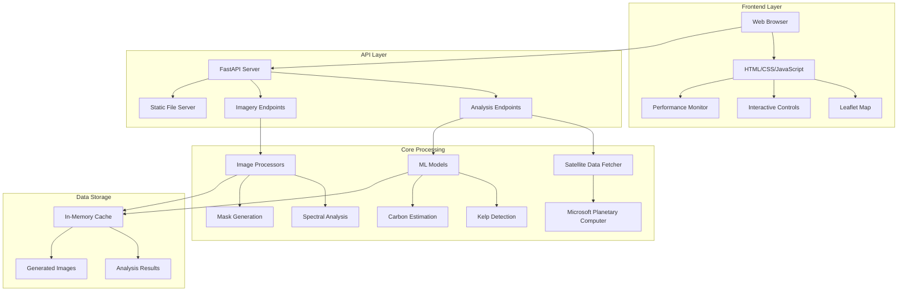
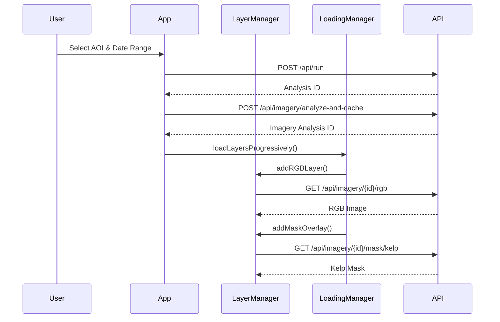
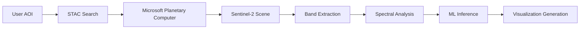
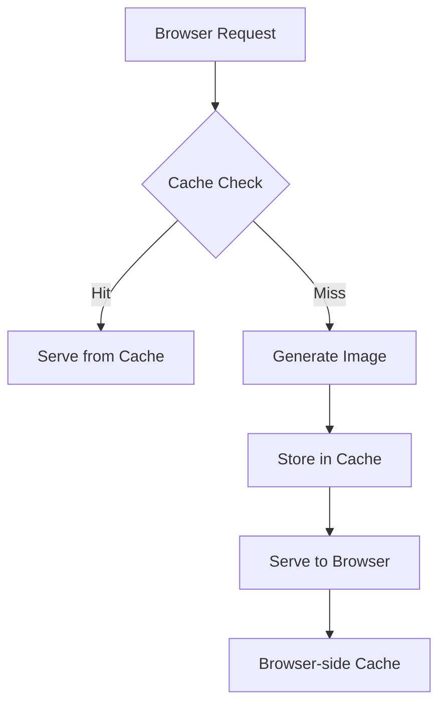
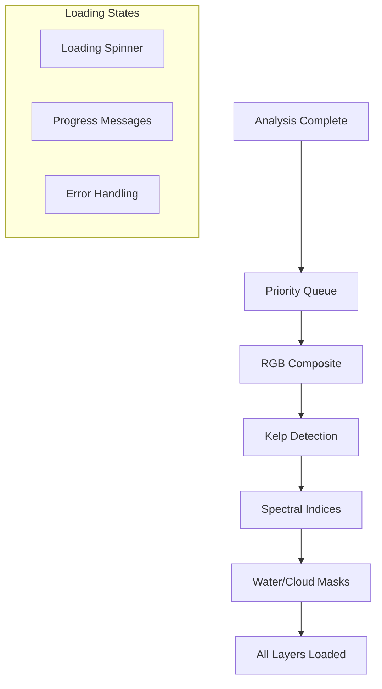

# 🏗️ Kelpie Carbon v1: System Architecture

## **Overview**

Kelpie Carbon v1 is a modern, scalable web application for analyzing kelp forest carbon sequestration using satellite imagery. The architecture follows a microservices-inspired design with clear separation between the backend API, frontend interface, and data processing components.

## **System Architecture Diagram**



## **Component Architecture**

### **1. Frontend Architecture**

#### **Core Components**
- **`index.html`**: Single-page application entry point
- **`app.js`**: Main application controller and orchestrator
- **`layers.js`**: Satellite layer management and Leaflet integration
- **`controls.js`**: Interactive UI controls for opacity, legend, metadata
- **`loading.js`**: Progressive loading and caching system
- **`performance.js`**: Real-time performance monitoring
- **`style.css`**: Responsive styling and animations

#### **Data Flow**


### **2. Backend Architecture**

#### **FastAPI Application Structure**
```python
src/kelpie_carbon_v1/api/
├── main.py           # FastAPI app initialization, middleware, CORS
├── analysis.py       # Traditional analysis endpoints (/api/run)
└── imagery.py        # Satellite imagery endpoints (/api/imagery/*)
```

#### **Core Processing Modules**
```python
src/kelpie_carbon_v1/core/
├── fetch.py          # Satellite data retrieval from Planetary Computer
├── model.py          # ML models for kelp detection and carbon estimation
├── generators.py     # RGB composite and visualization generation
└── overlays.py       # Analysis overlay generation (masks, heatmaps)
```

#### **Image Processing Pipeline**
```python
src/kelpie_carbon_v1/imagery/
├── indices.py        # Spectral index calculations (NDVI, FAI, NDRE)
├── mask.py           # Cloud, water, and kelp masking
└── utils.py          # Image normalization and utility functions
```

### **3. Data Processing Architecture**

#### **Satellite Data Pipeline**


#### **Machine Learning Workflow**
1. **Feature Extraction**: Band statistics and spectral indices
2. **Model Inference**: Random Forest classification for kelp detection
3. **Post-processing**: Morphological operations and filtering
4. **Carbon Estimation**: Biomass-to-carbon conversion using allometric equations

## **Technology Stack**

### **Backend Technologies**
- **FastAPI**: High-performance async web framework
- **Python 3.12+**: Modern Python with type hints
- **NumPy**: Numerical computing and array operations
- **Scikit-learn**: Machine learning models and preprocessing
- **Pillow (PIL)**: Image processing and generation
- **Matplotlib**: Scientific visualization and plotting
- **Planetary Computer Python SDK**: Satellite data access
- **Pydantic**: Data validation and serialization

### **Frontend Technologies**
- **Vanilla JavaScript (ES6+)**: Modern JavaScript without frameworks
- **Leaflet.js**: Interactive mapping and geospatial visualization
- **HTML5**: Semantic markup and modern web standards
- **CSS3**: Responsive design, flexbox, animations
- **Fetch API**: Asynchronous HTTP requests

### **External Services**
- **Microsoft Planetary Computer**: Sentinel-2 satellite data access
- **ESA Copernicus**: Source of Sentinel-2 imagery
- **OpenStreetMap**: Base map tiles via Leaflet

### **Configuration Architecture**
- **SimpleConfig**: Dataclass-based configuration (77% complexity reduction)
- **Environment Variables**: `KELPIE_*` environment variable support
- **Validation**: Built-in configuration validation at startup
- **Backward Compatibility**: Adapter layer for legacy configuration

## **Performance Architecture**

### **Caching Strategy**


#### **Multi-Level Caching**
1. **Browser Cache**: HTTP cache headers for 1 hour
2. **Application Cache**: In-memory storage for generated images
3. **Client-side Cache**: JavaScript blob URL caching

### **Progressive Loading System**


### **Error Recovery Architecture**
- **Exponential Backoff**: 1s, 2s, 4s retry intervals
- **Circuit Breaker**: Temporary failure isolation
- **Graceful Degradation**: Continue loading other layers on failure
- **User Feedback**: Clear error messages with retry options

## **Security Architecture**

### **Input Validation**
- **Pydantic Models**: Request/response validation
- **Coordinate Bounds**: Geographic boundary checking
- **Date Range Validation**: Reasonable temporal constraints
- **File Size Limits**: Prevent resource exhaustion

### **CORS Configuration**
```python
origins = [
    "http://localhost",
    "http://localhost:8000",
    "http://127.0.0.1:8000",
]
```

### **Error Handling**
- **No Sensitive Data Exposure**: Generic error messages to clients
- **Detailed Server Logs**: Comprehensive error tracking
- **Input Sanitization**: Protection against injection attacks

## **Scalability Considerations**

### **Horizontal Scaling**
- **Stateless Design**: No server-side session storage
- **Cacheable Responses**: HTTP cache headers for CDN compatibility
- **Load Balancer Ready**: No server affinity requirements

### **Vertical Scaling**
- **Async Processing**: Non-blocking I/O with FastAPI
- **Memory Management**: Automatic cache cleanup and rotation
- **Resource Monitoring**: Real-time performance tracking

### **Database-Free Architecture**
- **In-Memory Storage**: Fast access to temporary results
- **External Data Sources**: Microsoft Planetary Computer for satellite data
- **Stateless Operations**: No persistent storage requirements

## **Development Architecture**

### **Code Organization Principles**
- **Separation of Concerns**: Clear module boundaries
- **Single Responsibility**: Each module has one primary function
- **Dependency Injection**: Configurable components
- **Interface Segregation**: Minimal coupling between modules

### **Testing Architecture**
```
tests/
├── unit/                    # Individual component tests
├── integration/             # End-to-end workflow tests
├── performance/             # Load and performance tests
└── fixtures/               # Test data and mock objects
```

### **Phase-Based Development**
The system was built incrementally across 5 phases:
1. **Foundation**: Core image generation
2. **Visualization**: Spectral analysis layers
3. **Analysis**: Detection and masking overlays
4. **Interaction**: User controls and interface
5. **Polish**: Performance optimization and monitoring

## **Deployment Architecture**

### **Development Deployment**
```bash
# Local development server
poetry run uvicorn src.kelpie_carbon_v1.api.main:app --reload
```

### **Production Deployment Options**

#### **Docker Containerization**
```dockerfile
FROM python:3.12-slim
WORKDIR /app
COPY pyproject.toml poetry.lock ./
RUN pip install poetry && poetry install --no-dev
COPY src/ ./src/
CMD ["uvicorn", "src.kelpie_carbon_v1.api.main:app", "--host", "0.0.0.0"]
```

#### **Cloud Deployment**
- **AWS**: ECS/Fargate with ALB
- **Google Cloud**: Cloud Run with load balancing
- **Azure**: Container Instances with Application Gateway

### **Monitoring and Observability**
- **Built-in Performance Dashboard**: Real-time metrics
- **Server Logs**: Structured logging with timestamps
- **Health Checks**: Built-in FastAPI health endpoints
- **Metrics Export**: JSON export for external monitoring

## **Future Architecture Considerations**

### **Database Integration**
- **PostgreSQL**: For persistent analysis results
- **Redis**: For distributed caching
- **TimescaleDB**: For time-series environmental data

### **Microservices Evolution**
- **Analysis Service**: Dedicated ML processing
- **Imagery Service**: Specialized image generation
- **Data Service**: Satellite data management

### **Advanced Features**
- **WebSockets**: Real-time progress updates
- **Background Tasks**: Celery for long-running processes
- **API Rate Limiting**: Protection against abuse
- **User Authentication**: Multi-user support

---

This architecture provides a solid foundation for a production-ready kelp forest carbon assessment application while maintaining flexibility for future enhancements and scaling requirements.
